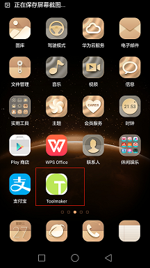
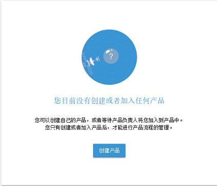
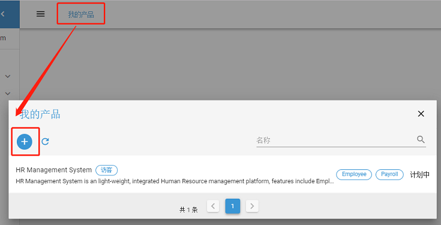
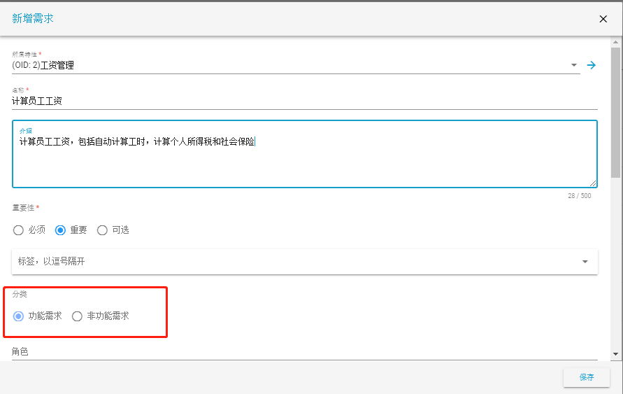
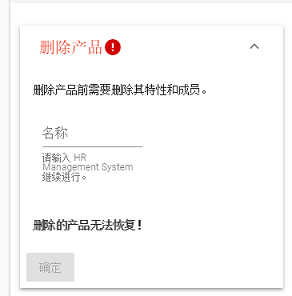

简体中文 | [English](./README.english.md)

# 目录
 * [一、Toolmaker是什么](#1)
 * [二、产品领先之处](#2)
 * [三、特性列表](#3)
 * [四、运行环境](#4)
 * [五、使用手册](#5)
 * [六、定制开发](#6)
 * [七、联系方式](#7)
 * [八、投资与募捐](#8)
 * [九、致谢](#9)

 ## <h2 id="1">一、Toolmaker是什么</h2>
 ### 1.1 Toolmaker是什么
  * Toolmaker是一款轻量级、基于web、集成式的软件生命周期管理（ALM）软件，涉及需求分析、系统设计、测试管理、缺陷跟踪、任务管理、风险管理等诸多特性，是对自己长达十几年在软件工程领域积累的工作经验的工具化探索，欢迎注册并使用。

 ### 1.2 解决的问题
  * 普遍缺乏符合软件工程定义的软件开发流程
  * 项目管理过程碎片化
  * 项目管理工具阶段化、多样化
  * 项目文档交付物杂乱
  * 经验与知识不能有效传承 

 ### 1.3 能够提供
  * 基于软件工程定义的开发流程
  * 连续统一的软件开发流程管理，从最初的原始需求收集到最后的产品维护终结
  * 摒弃各个阶段独立的管理工具，提供一站式平台操作
  * 不再需要各种格式的文档，全部数据保存在平台中
  * SaaS软件，注册既使用，无需安装和维护
  * 人性化、简洁的操作界面，使用一次既上手

 ### 1.4 适用范围
  * 中小互联网企业的软件开发流程管理
  * 大中小企业IT部门的软件开发流程管理

 ### 1.5 口号
  * Toolmaker不关注你开发什么，而是关注你如何开发。
  * Toolmaker don't care about what you do，but how you do.

 ### 1.6 名字缘起
Toolmaker这个名字，受到电影《星球大战前传II--克隆人的进攻》一句台词的启发，其中一个情节是机器人C-3PO误入帝国的机器人士兵制造工厂，张口说道“Machines making machines. Huh! How perverse.” 是的，Toolmaker making (software) tools，Toolmaker是一个软件工具的制造者，缘起如是。

 ### 1.7 预览地址
  * 登录[https://toolmaker.io](https://toolmaker.io)，使用“产品演示”功能，会以guest用户登录，该用户可以查看一个演示产品“HR Management System”的所有内容，但不能创建任何内容。
  * 注册新用户，创建产品，开始一个新产品的软件开发过程。

 ## <h2 id="2">二、产品领先之处</h2>
 #### 2.1 思想领先
  * 对软件开发过程与方法的深刻理解
  * 基于完整统一的软件开发过程领域模型进行设计

 #### 2.2 技术领先
  * 前端采用Material Design设计风格，支持多端显示：PC，Laptop，iPad，iPhone，Android，支持PWA
  * 后端微服务架构运行于AWS云环境，使用Lambda Serverless、CloudFront、RDS等技术，自动扩展不断增加的业务量

 ## <h2 id="3">三、特性列表</h2>
  ### 3.1 产品管理（已上线）
  * 多产品管理，用户可以创建多个产品，各个产品内容完全隔离，独立开发，互不干扰
  * 用户可以加入/退出产品，在加入的产品中切换，执行不同的开发角色和开发任务
  ### 3.2 用户管理（已上线）
  * 注册用户
  * 基于开发角色（产品经理/设计/开发/测试工程师）的权限管理
  ### 3.3 原始需求管理
  ### 3.4 特性管理（已上线）
  * 创建特性
  * 复制冻结恢复特性
  ### 3.5 需求管理（已上线）
  * 创建需求
  * 复制冻结恢复需求
  * 特性-需求跟踪
  ### 3.6 设计管理
  ### 3.7 测试管理
  ### 3.8 任务管理
  ### 3.9 项目管理

 ## <h2 id="4">四、运行环境</h2>
  * 浏览器：支持Chrome，Firefox，Safari，Edge
  
       

  * 手机PWA模式：Toolmaker支持PWA模式。以Chrome浏览器为例：
      手机下载Chrome浏览器最新版本，打开https://toolmaker.io 网站，在浏览器操作菜单中主动选择“添加到主屏幕”，此时在手机屏幕生成一个APP图标，就可以转变为一个类似APP的应用,效果如最右图：

           
      

 ## <h2 id="5">五、使用手册</h2>
  ### 5.1 用户注册与登录
  * 用户填写用户名称和Email进行注册。使用邮箱进行验证，点击获取验证码，系统会把注册验证码发送到用户填写的邮箱中。用户登录邮箱获取验证码，填写验证码和密码后进行注册;
  * 注册成功后，用户即可以登录使用系统。

  ### 5.2 创建新产品
  * 用户第一次登录系统后，根据提示进行创建产品，创建完成后点击切换至该产品，即可以邀请成员，开始创建特性和需求；
  * “个人版本”一个用户最多可以创建3个产品；

    

  * 在任何时刻，用户可以点击顶部菜单“我的产品”进行查看目前加入的产品，或者创建新的产品。

    

  ### 5.3 邀请用户加入产品
  * 产品创建后，只有产品经理（默认为产品创建者）才能邀请其他用户加入产品：点击左侧菜单->设置->成员，一次可以增加多个成员，并分配相应的角色。“个人版本”一个产品最多可以邀请包括产品经理在内5个成员。

    

  * 产品经理可以修改现有成员的角色，或者可以移除某个成员，同时移除该成员在产品内的所有权限。如果是非产品经理角色的成员登录系统，则可以在这个界面主动退出某个产品。

    

  ### 5.4 角色权限定义
  目前定义四种角色，分别是：
  * 产品经理（ProductManager）：权限包括创建产品与产品管理，邀请成员与成员管理，创建特性与特性管理，创建需求与需求管理，测试管理等所有权限；
  * 设计工程师（DesignEngineer）：权限包括创建产品，创建特性与特性管理，创建需求与需求管理，任务管理，测试管理等；
  * 开发工程师（DevelopEngineer）：权限包括创建产品，任务，风险，缺陷；
  * 测试工程师（TestEngineer）：权限包括创建产品，任务，风险，测试用例，缺陷；
  * 访客（Guest）：能读取产品所有数据，但不能修改和新建；

  ### 5.5 特性管理
  只有产品经理和设计工程师才有权限创建和管理特性。“个人版本”每个产品可以创建20个特性；  
  #### 5.5.1 创建特性
  点击左侧菜单->需求管理->特性，打开特性列表。点击特性列表的“+”号，填写填写名称，简介，分类，重要性，可获得性，客户价值，特性增强，依赖关系等选项进行创建；可以自定义Tag进行特性标识；

  ### 5.5.2 特性列表
  * 每列数据从左到右依次是：特性编码OID，名称，自定义Tag，重要性，状态，操作菜单。

    

  * 可以按照OID和特性名称查询
  * 可以按照最近修改日期，最近创建日期，特性名称排序
  * 可以按照状态过滤

    

  ### 5.5.3 特性操作
  * 编辑特性
  * 复制特性
  * 冻结/恢复特性
  * 删除特性。只有处于初始状态的特性才可以删除，删除的特性不能被恢复
  * 查询该特性下的需求列表。

    

  ### 5.6 需求管理
  只有产品经理和设计工程师才有权限创建和管理需求。“个人版本”每个特性可以创建30个需求；  
  #### 5.6.1 创建需求
  点击左侧菜单->需求管理->需求，打开需求列表。点击需求列表的“+”号，填写填写名称，简介，分类，重要性等内容进行创建；可以自定义Tag进行需求标识；
  如果需求分类选择了“功能需求”，则需求按照UseCase格式进行描述，输入角色，触发条件，前置条件，后置条件，处理过程，分支流程等内容；如果分类选择了“非功能需求”，则按照一般格式进行描述。
      

  ### 5.6.2 需求列表
  * 每列数据从左到右依次是：特性编码OID，需求编码OID，名称，自定义Tag，重要性，状态，操作菜单。

    

  * 可以特性名称进行过滤
  * 可以按照OID和需求名称查询
  * 可以按照最近修改日期，最近创建日期，需求名称排序
  * 可以按照状态过滤

    

  ### 5.6.3 需求操作
  * 编辑需求
  * 复制需求
  * 冻结/恢复需求
  * 删除需求。只有处于初始状态的需求才可以删除，删除的需求不能被恢复。
  * 查询该需求对应的特性信息

  ### 5.7 产品设置
   * 只有产品经理才可以执行产品设置；
   * 点击左侧菜单->设置->产品，可以修改产品名称，描述，分类等信息。
   * 更换产品经理，选择一个产品成员进行更换。更换后，原来的产品经理将赋予开发工程师的角色，而新的产品经理将接替他执行管理产品的任务。

  

  * 删除产品。删除产品是非常谨慎的操作，在确认删除一个产品前，需要删除该产品特性和成员（产品经理无法自我删除），必须输入正确的产品名称后才能删除，删除后的产品无法恢复。

    

  ### 5.8 用户设置
  * 点击右上角菜单->设置，执行用户信息设置
  * 修改用户密码
  * 修改界面显示语言，目前支持简体中文和English两种语言。
  * 更换头像

    

 ## <h2 id="6">六、定制开发</h2>
  * 我们可以在Toolmaker现有功能的基础上，为贵公司定制软件开发管理流程，以便更好的符合贵公司的业务流程，联系请发送邮件至：customerservice@toolmaker.com.cn。

 ## <h2 id="7">七、联系方式</h2>
  * 产品缺陷或新需求可以通过[Github Issues](https://github.com/CHCP/toolmaker-docs/issues)提出并获得解答；或者加入QQ群150129626讨论，加入时请注明“Toolmaker”；
  * 请关注我们的微信公众号：微信公众号搜索"CHCP"；或者扫描下方二维码关注：

    
 
 ## <h2 id="8">八、投资与捐款</h2>
  * 为了能使产品生存下来并得到进一步的发展，我们寻找并接受风险投资，寻找更多更专业的人来开发运营这个产品，有意者请邮件联系：customerservice@toolmaker.com.cn。
  * 目前团队成员都是在业余时间来开发维护这个产品，产品的“个人版本”是免费使用的，如果您觉得产品功能还不错，愿意支持我们，可以按照如下方式进行捐款，捐款所得款项将用来支付购买云计算费用，宣传广告，以及开发过程中的各种成本支出，我们非常感谢您的支持。
  
          
    
 ## <h2 id="9">九、致谢</h2>
  * 感谢团队开发成员，他们都是在业余时间来开发这个产品，感谢他们对这个产品的热情和精湛的专业技能。
